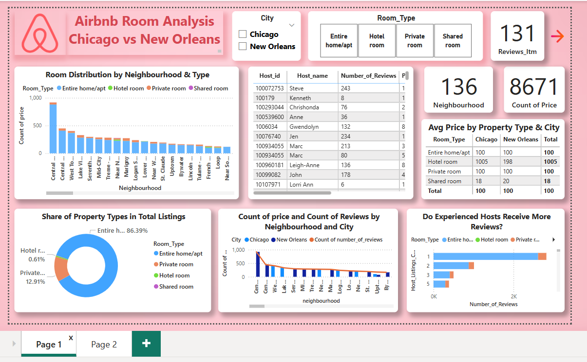

# Airbnb Room Analysis Dashboard 🏘️

An interactive **Power BI dashboard** that compares Airbnb listings between **Chicago** and **New Orleans**, focusing on room distribution, pricing, host performance, and neighborhood trends.

---

## 🔗 Live Dashboard

> 📈 **View it Live on Power BI Service**  
[🔗 Click here to open the dashboard](https://app.powerbi.com/view?r=eyJrIjoiOTc1ZDY4YWEtNjc1OS00NmQzLTkyMWMtNmRmY2E4MTc2Yzc1IiwidCI6IjI0MGMyNTRiLTgzOTItNDI1MC05ODM0LWQxZTc3ZGNjMWI4OSJ9)

---

## 📊 Key Insights

- 📍 **Room Distribution** by Neighborhood & Room Type
- 🧑‍💼 **Top Hosts** ranked by Number of Reviews
- 🏘️ **Property Type** share in total listings
- 💰 **Average Price** comparison across cities and room types
- 👥 Do **Experienced Hosts** receive more reviews?

---

## ⚙️ Tools & Technologies

- Power BI (for data visualization)
- Excel / CSV (data cleaning)
- DAX (for calculated fields and interactivity)

---
